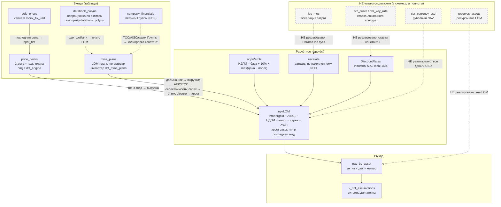

# Карта полноты данных DCF-контура (Полюс)

> **Что это.** Ответ на три вопроса: из чего состоит прогнозный движок, чем он заполнен сейчас (в процентах), и что заполнять первым. Документ ведётся вручную по публичным источникам; он не генерируется из БД, потому что половина пробелов — принципиально непубликуемые данные, которых SQL-запрос не покажет.
>
> **Чем не является.** Не заменяет `ARCHITECTURE.md` §6.2/§6.4 (источник истины по DDL и конвенциям) и не дублирует `docs/ROADMAP_DCF_POLYUS.md`. Отвечает только за полноту входов. Обновляется тем же PR, что меняет сид.
>
> **Актуально на:** 2026-10-11. Источники — Годовой обзор ПАО «Полюс» за 2025 год и презентация «Ключевые проекты роста» (декабрь 2024).

---

## 1. Схема зависимостей движка

**Как читать:** сплошные стрелки — реализованный путь данных; пунктирные в блоке `НЕ читаются движком` — ряды, которые лежат в БД, но **в формулу NAV не входят**. Их наличие в схеме важно именно как перечень нереализованного: `ipc_mes` не эскалирует затраты, `ofz_curve`/`cbr_key_rate` не задают локальную ставку (она константа 0.16), `cbr_currency_usd` не используется (все деньги USD), `reserves_assets` не участвует.

---

## 2. Карта покрытия по активам

Статусы: **факт** — опубликовано, источник со страницей; **derived** — выведено по публичной формуле; **assumption** — допущение с обоснованием; **missing** — нет.

Источники (сокращения): **ГО2025** — Годовой обзор ПАО «Полюс» за 2025 год; **ДЕК** — презентация «Ключевые проекты роста», декабрь 2024.

| Актив | `production_koz` | `grade_gpt` | `tcc` | `aisc` | `capex_sustaining` | `capex_project` | `closure_costs` |
|---|---|---|---|---|---|---|---|
| OLIMPIADA | факт (ГО2025, 926.5 koz) | факт | факт (773) | derived | факт (450) | assumption (0) | missing |
| BLAGODATNOYE | факт (434.0) | факт | факт (691) | derived | факт (370) | assumption (0) | missing |
| NATALKA | факт (567.4) | факт | факт (671) | derived | факт (198) | assumption (0) | missing |
| VERNINSKOYE2 | факт (271.7) | факт | факт (735) | derived | факт (125) | assumption (0) | missing |
| KURANAKH | факт (329.7) | факт | факт (925) | derived | факт (362) | assumption (0) | missing |
| TITIMUKHTA | **missing** (факт = 0) | факт | assumption (прокси БУ 773) | derived | **missing** | assumption (0) | missing |
| ZAPADNOYE | **missing** (ряда за 2025 нет) | факт | assumption (прокси БУ 671) | derived | **missing** | assumption (0) | missing |
| Sukhoi Log | факт (профиль 2 300–2 800, ДЕК) | факт (2.3–2.8 г/т) | assumption (прокси Иркутской БЕ 735) | derived | assumption (0) | assumption (6 000 итог, размазан) | missing |

### Покрытие по столбцам

| Столбец | Факт | Derived | Assumption | Missing | Доля фактических |
|---|---|---|---|---|---|
| `production_koz` | 6 | 0 | 0 | 2 | **6 / 8 = 75 %** |
| `grade_gpt` | 8 | 0 | 0 | 0 | **8 / 8 = 100 %** |
| `tcc` | 5 | 0 | 3 | 0 | 5 / 8 = 63 % |
| `aisc` | 0 | 8 | 0 | 0 | 0 / 8 = 0 % |
| `capex_sustaining` | 5 | 0 | 0 | 3 | 5 / 8 = 63 % |
| `capex_project` | 0 | 0 | 8 | 0 | 0 / 8 = 0 % |
| `closure_costs` | 0 | 0 | 0 | 8 | **0 / 8 = 0 %** |

### Покрытие по активам

| Актив | Фактических столбцов из 7 | Полностью обеспечен? |
|---|---|---|
| OLIMPIADA | 4 | нет (aisc derived, capex_project assumption, closure missing) |
| BLAGODATNOYE | 4 | нет |
| NATALKA | 4 | нет |
| VERNINSKOYE2 | 4 | нет |
| KURANAKH | 4 | нет |
| TITIMUKHTA | 1 | нет (только grade; добыча, TCC, capex — не факт) |
| ZAPADNOYE | 1 | нет (только grade) |
| Sukhoi Log | 2 | нет (только добыча и grade) |

**Ни один актив не обеспечен полностью; максимум — 4 факта из 7 (у пяти действующих рудников).** Доля фактических входов по всем ячейкам: 24 из 56 = **43 %** (сумма столбца «Факт» из таблицы выше: 6+8+5+0+5+0+0).

> **Что означает этот процент.** Это доля **заполненных входов**, а не точность NAV. Столбец `closure_costs` пуст у всех восьми — это ноль процентов покрытия при относительно малом влиянии на NPV (провижен Группы $75 млн против сотен миллионов годового потока). Столбец `aisc` заполнен у всех восьми на 100 %, но целиком через `derived`. Поэтому «43 % покрытия» ≠ «NAV верен наполовину»: часть пробелов меняет NAV на доли процента, а пропуск `production_koz` у двух активов убирает их из расчёта целиком.

---

## 3. Приоритизированный список пробелов

Приоритет — по влиянию на NAV и по тому, насколько молчаливо дефект проявляется.

| # | Пробел | Почему в этом месте | Влияние на NAV | Что нужно, чтобы закрыть |
|---|---|---|---|---|
| **1** | **Налоговый режим Сухого Лога (РИП)** | С 01.01.2024 Сухой Лог в реестре региональных инвестиционных проектов: льготный налог на прибыль **10 %** против базовых 25 %, льготная НДПИ; график льгот — до 2039 (ДЕК, слайд 24). Модель считает его **той же формулой**, что и действующие рудники (`ProfitTaxPct`, `ndpiPerOz` — общие) | **Прямое и систематическое**: крупнейший проект портфеля (43.3 Moz) облагается по неверной ставке, а его горизонт уходит в 2030-е, где эффект максимален | Отдельный пункт роадмапа: ставки по активу, а не по модели. Менять `ndpiPerOz`/`ProfitTaxPct` на per-asset конфигурацию |
| **2** | **AISC по активам не публикуется** | Группа даёт только групповой AISC ($1 437/oz за 2025). Значение по активу выведено как `TCC актива + 698` — групповой клин «поддержание» применён ко всем одинаково | **Среднее, но по каждому активу сразу**: один клин на активы с разной структурой затрат искажает маржу каждого; ошибка смещает и решение по активу | Нет публичного источника. Снижать погрешность можно отраслевыми бенчмарками или раскрытием в презентациях — вне текущих источников |
| **3** | **База и порог НДПИ в модели** | `defaultParams`: `NdpiBaseUSDPerOz = 0`, `NdpiThresholdUSD = 1900`. Публично с 01.01.2025: **базовая ставка НДПИ 6 %** и надбавка 10 % от превышения LBMA над **$1 897**/oz (ГО2025) | **Прямое и на весь портфель**: нулевая база занижает НДПИ по каждому активу и году; порог 1900 против 1897 — малая, но систематическая разница | Отдельный пункт роадмапа: вынести базовую ставку НДПИ в `Params`, сверить порог с публикацией |
| **4** | **Capex без split sustaining/project** | Публикация даёт capex по бизнес-юнитам, но не делит на поддержание и развитие. Вся сумма уходит в `capex_sustaining`, `capex_project = 0` (у Сухого Лога наоборот — итог проекта в `capex_project`) | **Среднее**: при непрерывном поддержании это ближе к истине, чем кажется, но у активов в стадии расширения (Благодатное, Куранах) недооценивается развитие и искажается срок окупаемости | Нет публичного split. Можно разделить по описаниям проектов (Mill 5, расширение ЗИФ) — экспертная оценка, отдельный пункт |
| **5** | **По-годичный профиль добычи для действующих рудников** | Публикуется срок службы по MOPs и 10-летние средние по проектам роста, но **не по-годичный график** добычи. Сейчас — плато последним фактом на весь срок | **Среднее**: форма потока влияет на дисконт, а год хвоста закрытия задаётся последним годом плана. Плато систематически не даёт падения добычи в хвосте | Нет публичного источника. Парсинг техотчётов/JORC при их появлении — отдельный пункт |
| **6** | **Closure по активам** | Публикуется только групповой провижен ($75 млн non-current на 31.12.2024). Per-asset нет. В сиде `closure_costs = 0` у всех — это означает «не задано», а **не** «закрытие бесплатно» | **Малое по величине**, но обязательное по смыслу: хвост закрытия — единственная отрицательная терминальная стоимость, и его отсутствие слегка завышает каждый NPV | Распределить групповой провижен по активам (пропорционально запасам или добыче) — допущение, требующее решения владельца |
| **7** | **Форма ценовой кривой деков** | Формы нет в публичных источниках: цена задана плоско на все годы по трём якорям (`spot_flat` — последний MOEX-фикс, `consensus_lt` $3 000, `own_scenario` $4 600) | **Сильное по дисконту, но непринципиальное по честности**: плоскость — явное допущение, а не неверные данные. Форма кривой — отдельный пункт, когда появится содержательный вход | Нет публичного источника формы. Собственный сценарий (§6.4) — единственный кандидат |

**Дополнительно, вне основной таблицы:**

- **TITIMUKHTA и ZAPADNOYE выпадают из плана целиком.** В датапаке `Total Dore gold output` для них равно нулю за все годы 2023–2026 (а у Западного после 2024 ряда нет вовсе): добыча этих активов учтена отдельной таблицей `ALLUVIALS`. Правило «нет факта — не пишем строку» отбрасывает их с предупреждением, поэтому в `mine_plans` попадают **6 активов из 8**. Это не дефект правила (ноль на месте факта тихо занизил бы NAV), но это означает, что россыпная добыча сейчас в NAV не учтена. Закрывается отдельным пунктом — включением `ALLUVIALS` как актива.
- **Чульбаткан и Чертово Корыто не входят в сид.** Данные собраны (запуск 2029, 0.3 и 0.3–0.4 млн унц/год, capex $0.6–0.8 млрд и ~$1.0 млрд) — это следующий пункт после текущего.

---

## 4. Правило приёмки

Гард `checkYearCoverage` (`dcf/coverage.go`) проверяет: **у каждого года каждого плана обязана быть цена в каждом каноническом деке**. Частичное покрытие — предупреждение с перечнем непокрытых пар `актив:год`; полное отсутствие пересечения — ошибка, потому что тогда все годы пропускаются и `nav_by_asset` получает нулевой NPV при непустых `mine_plans`.

Это же правило — причина, по которой сид `price_decks` пишет цену на **все** годы плана, а не на текущий год: одногодичный дек обнулял бы план за пределами первого года, а на единственном году пересечения ещё и делал бы оба контура ставки неразличимыми (`1/(1+rate)^0 = 1`).
